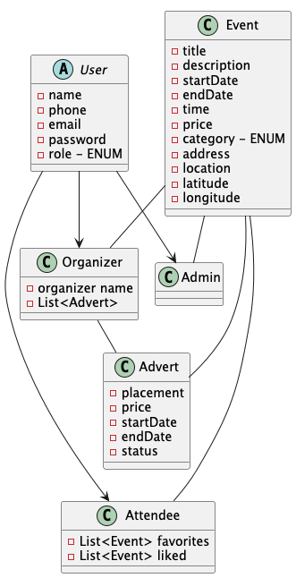

Making user stories to get a better grasp of the projects and make it easier to analyze further on. First in form of a domain model seen below, though it's a rough model and probably will evolve doing the project.

