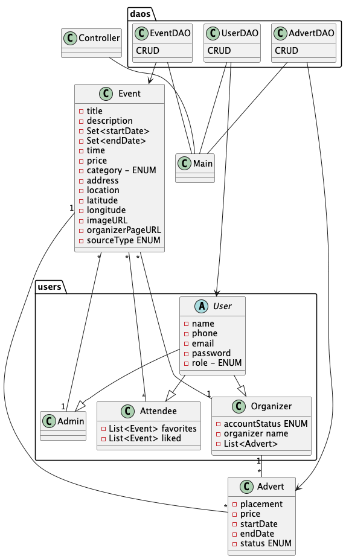

## Class Diagram

Working from the domain model and user stories, I started creating a class diagram and mapping out the relations between entities.

While building the class diagram, I coded alongside it — starting with all entities from the domain model to get a better overview and catch anything I might be missing.

I changed `Event` to an abstract class, since I wanted to support both one-time and recurring events. In the end I only needed `Event`, because I decided to store dates in a `Set` instead of splitting into subclasses.

After that, I added the `ENUMS` I needed and filled in their constants.

## JPA

Next was wiring up the relations through **_JPA_** annotations. I started simple — `@OneToOne`, `@OneToMany`, `@ManyToMany` — and built from there. Two areas needed extra research making annotations for `Sets` from `Collections`, and `abstract` entity classes.

**Sets**

```java
@ElementCollection
```

**abstract classes**

```java
@Inheritance(strategy = InheritanceType.SINGLE_TABLE)
```

Every subclass of an abstract entity gets its own table, keeping the inheritance hierarchy properly represented in the database.


